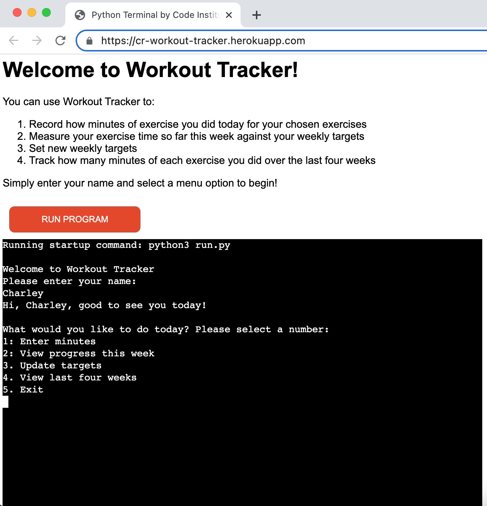
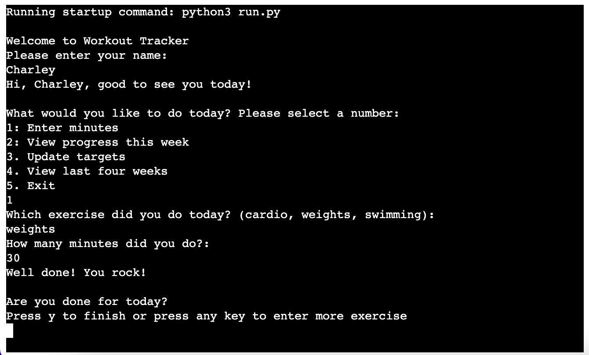
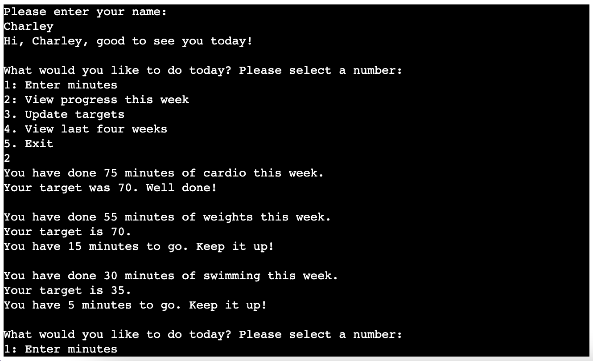
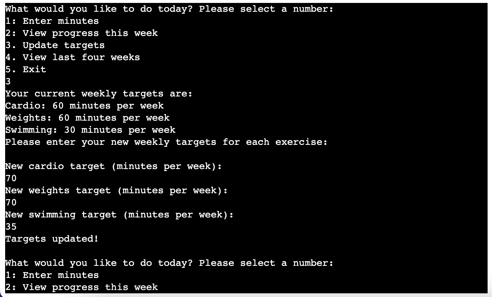
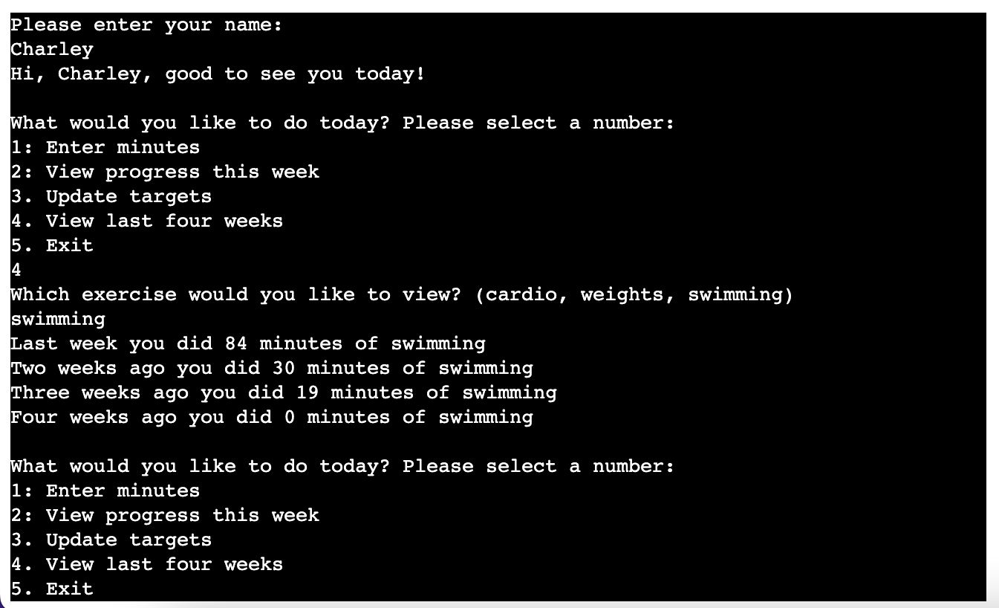
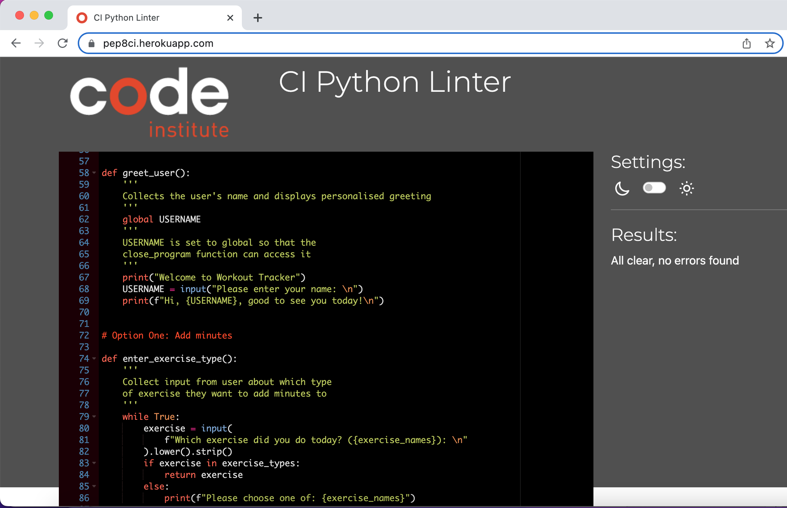

# Workout Tracker

Workout Tracker is a command-line Python program which enables users to record and view the amount of time they spend doing different types of exercise. Users can enter the number of minutes they spent on each workout, set themselves weekly targets for each type of exercise and view how much progress they have made towards meeting the current week's target. They can also choose to view how much time they spent on each exercise over the preceeding four weeks.

It is deployed via Heroku and displayed to the user in a web browser using Code Institute's mock terminal template.

The live version of the app is here: https://cr-workout-tracker.herokuapp.com/

The idea for this project came to me while I was on the treadmill at the gym, trying to think up ideas for a simple data manipulation program that could serve some useful purpose in people's everyday lives.

## Users and their goals

Users of this program would be people who are making an effort to incorporate regular exercise into their routine and would like a little additional help and motivation to achieve this aim. The program helps users in two main ways:

1. The program helps make regular exercise more engaging by 'gamifying' it - enabling users to set targets for themselves and track their progress every week towards hitting their target, and encouraging them to match or improve on the time they have spent exercising over the preceding four weeks, in order to improve their fitness level and health outcomes.

2. It also helps people to hold themselves accountable and ensure they allocate sufficient time for exercise, as recording their times helps them to keep track of exactly how much exercise they have done in a given week, and setting weekly targets reminds and encourages them to keep including exercise in their regular routine alongside other competing demands on their time.

Potential users could be of any age and gender, although are more likely to be adults. 

The program could be used by participants in any sport or activity - a real-life version would enable users to select or enter the name(s) of the exercise(s) they wish to track.

## What it does

On opening the program, the user can choose to do one of four things (or five including exiting the program):

1. Enter minutes

This option allows the user to input the number of minutes they have spent on their chosen exercise(s). They can choose to enter minutes just for one type of exercise, or for more than one.  After each entry, the program asks the user if they would like to enter more exercise or to exit that option.

The program currently assumes that the user is entering 'today's' exercise: a future version of the program could allow the user to select the date on which the exercise was completed.

2. View progress this week

This option displays a list of the user's exercise types, stating how many minutes they have done so far in the current week, what their weekly target is, and either the encouragement to 'keep going!' if they have not yet met their target or the message 'well done!' if they have.  

The program assumes that each week begins on a Monday.  This is because gym usage statistics (such as Google's 'Popular Times' feature) indicate that gym usage tends to be highest on a Monday and gradually decreases throughout the week towards the end of the weekend, so beginning the week on a Monday is most likely to be relevant to users.

3. Update targets

Here the user can input new weekly targets for each of their exercises.

4. View last four weeks

The user picks an exercise, and the program displays the total number of minutes the user entered for that exercise for each of the four preceding whole weeks.  (Again, the program counts a whole week as the time period Monday-Sunday.)

After each option, the program returns to the main menu, where users can choose to use another function or to exit the program.

## Features

### Existing features

1. Allows the user to enter data (in Option 1 'Enter minutes' and Option 3 'Update targets')

2. Stores the user's data in a connected Google Sheet

3. Fetches and performs calculations on the user's data, including:
    - total number of minutes of each exercise entered so far this week
    - number of minutes to go until the user hits their weekly target
    - total number of minutes of each exercise entered in the last four weeks

4. Input validation:
    - where a number is required, checks that the user has entered a number
    - on the main menu, checks that the number is between 1 and 5
    - where a string is required, checks the user has entered a string that matches the name of one of their exercises (with lowercase and strip functions called on the user input to convert any capital letters to lowercase and remove whitespace)

5. Gives a personalised greeting (after the user has entered their name) on opening and exiting the program

6. Gives messages of encouragement dependent on how many minutes of exercise the user has completed, for example, "Well done! You rock!" if the user enters a number of minutes greater than 15, or, "Good job! Every little helps!" if the number of minutes entered is less than 15 (but greater than 0).

### Design

The front end design for the Heroku template was provided by Code Institute. I chose to add some additional text in the html to explain to the user what the program is and does. As this was a purely Python project I didn't feel that this required any additional styling.

The only 'design' decisions I needed to make within the Python code was the addition of new line breaks to space out the text in the terminal in places to make it slightly easier to read.

### Features that would be added for real-world deployment

If this project were to be deployed as a real-world app, it would require the following features:

1. Ability for the user to create an account and log in.
2. Ability for the user to choose or enter the names of the exercise(s) they wanted to track.
3. More secure data storage than Google Sheets.
4. A graphical user interface. This program would be particularly suited to being deployed as a mobile app, so that users could enter their workout details on their phone shortly after having completed it.

### Future features

A future version of this program could also include:
1. The ability to select a date on which the exercise was completed (rather than just using today's date as the program currently does).
2. The ability for users to share their updates with friends also using the same app, perhaps in a newsfeed style area.
3. The ability to track more details about each workout, such as types of weightlifting exercises and number of sets and reps completed in a weight training workout.

## Testing

### Testing done throughout the development process

### Bugs (fixed/remaining)

(Needing to format Google Sheet to be number rather than automatic data type?
(List vs dictionary?)

### Validator testing

The code was passed through Code Institute's Python Linter https://pep8ci.herokuapp.com/ with no remaining issues. 

## Deployment process

## Technologies used

Python 3

Heroku

Google Sheets for storing data inputted by the user

(plus HTML, CSS and Javascript within the Heroku template provided by Code Institute)

## Credits

Heroku template provided by Code Institute

Instructions on connecting Google Sheets to VSCode taken from Code Institute's 'Love Sandwiches' walkthrough project

Welcome Charley Roberts,

This is the Code Institute student template for deploying your third portfolio project, the Python command-line project. The last update to this file was: **August 17, 2021**

## Reminders

* Your code must be placed in the `run.py` file
* Your dependencies must be placed in the `requirements.txt` file
* Do not edit any of the other files or your code may not deploy properly

## Creating the Heroku app

When you create the app, you will need to add two buildpacks from the _Settings_ tab. The ordering is as follows:

1. `heroku/python`
2. `heroku/nodejs`

You must then create a _Config Var_ called `PORT`. Set this to `8000`

If you have credentials, such as in the Love Sandwiches project, you must create another _Config Var_ called `CREDS` and paste the JSON into the value field.

Connect your GitHub repository and deploy as normal.

## Constraints

The deployment terminal is set to 80 columns by 24 rows. That means that each line of text needs to be 80 characters or less otherwise it will be wrapped onto a second line.

-----
Happy coding!