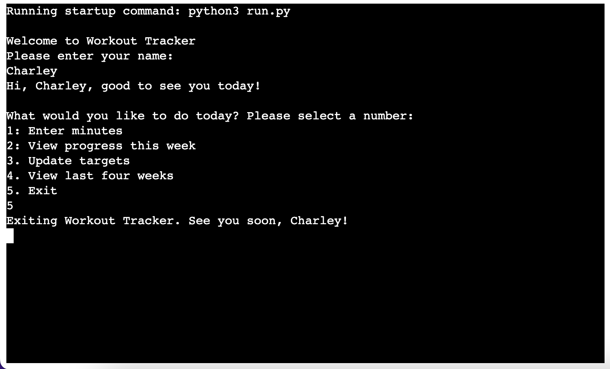

# Workout Tracker

Workout Tracker is a command-line Python program which enables users to record and view the amount of time they spend doing different types of exercise. Users can enter the number of minutes they spent on each workout, set themselves weekly targets for each type of exercise and view how much progress they have made towards meeting the current week's target. They can also choose to view how much time they spent on each exercise over the preceeding four weeks.

It is deployed via Heroku and displayed to the user in a web browser using Code Institute's mock terminal template.

The live version of the app is here: https://cr-workout-tracker.herokuapp.com/

The idea for this project came to me while I was on the treadmill at the gym, trying to think up ideas for a simple data manipulation program that could serve some useful purpose in people's everyday lives.

## Users and their goals

Users of this program would be people who are making an effort to incorporate regular exercise into their routine and would like a little additional help and motivation to achieve this aim. The program helps users in two main ways:

1. The program helps make regular exercise more engaging by 'gamifying' it - enabling users to set targets for themselves and track their progress every week towards hitting their target, and encouraging them to match or improve on the time they have spent exercising over the preceding four weeks, in order to improve their fitness level and health outcomes.

2. It also helps people to hold themselves accountable and ensure they allocate sufficient time for exercise, as recording their times helps them to keep track of exactly how much exercise they have done in a given week, and setting weekly targets reminds and encourages them to keep including exercise in their regular routine alongside other competing demands on their time.

Potential users could be of any age and gender, although are more likely to be adults. 

The program could be used by participants in any sport or activity - a real-life version would enable users to select or enter the name(s) of the exercise(s) they wish to track.

## What it does

On opening the program, the user can choose to do one of four things (or five including exiting the program):

1. Enter minutes

    This option allows the user to input the number of minutes they have spent on their chosen exercise(s). They can choose to enter minutes just for one type of exercise, or for more than one.  After each entry, the program asks the user if they would like to enter more exercise or to exit that option.

    The program currently assumes that the user is entering 'today's' exercise: a future version of the program could allow the user to select the date on which the exercise was completed.

2. View progress this week

    This option displays a list of the user's exercise types, stating how many minutes they have done so far in the current week, what their weekly target is, and either the encouragement to 'keep going!' if they have not yet met their target or the message 'well done!' if they have.  

    The program assumes that each week begins on a Monday.  This is because gym usage statistics (such as Google's 'Popular Times' feature) indicate that gym usage tends to be highest on a Monday and gradually decreases throughout the week towards the end of the weekend, so beginning the week on a Monday is most likely to be relevant to users.

3. Update targets

    Here the user can input new weekly targets for each of their exercises.

4. View last four weeks

    The user picks an exercise, and the program displays the total number of minutes the user entered for that exercise for each of the four preceding whole weeks.  (Again, the program counts a whole week as the time period Monday-Sunday.)

After each option, the program returns to the main menu, where users can choose to use another function or to exit the program.

## Features

### Existing features

1. Allows the user to enter data (in Option 1 'Enter minutes' and Option 3 'Update targets')

2. Stores the user's data in a connected Google Sheet

3. Fetches and performs calculations on the user's data, including:
    - total number of minutes of each exercise entered so far this week
    - number of minutes to go until the user hits their weekly target
    - total number of minutes of each exercise entered in the last four weeks

4. Input validation:
    - where a number is required, checks that the user has entered a number
    - on the main menu, checks that the number is between 1 and 5
    - where a string is required, checks the user has entered a string that matches the name of one of their exercises (with lowercase and strip functions called on the user input to convert any capital letters to lowercase and remove whitespace)

5. Gives a personalised greeting (after the user has entered their name) on opening and exiting the program

6. Gives messages of encouragement dependent on how many minutes of exercise the user has completed, for example, "Well done! You rock!" if the user enters a number of minutes greater than 15, or, "Good job! Every little helps!" if the number of minutes entered is less than 15 (but greater than 0).

### Design

The front end design for the Heroku template was provided by Code Institute. I chose to add some additional text in the html to explain to the user what the program is and does. As this was a purely Python project I didn't feel that this required any additional styling.

The only 'design' decisions I needed to make within the Python code was the addition of new line breaks to space out the text in the terminal in places to make it slightly easier to read.

### Features that would be added for real-world deployment

If this project were to be deployed as a real-world app, it would require the following features:

1. Ability for the user to create an account and log in.
2. Ability for the user to choose or enter the names of the exercise(s) they wanted to track.
3. More secure data storage than Google Sheets.
4. A graphical user interface. This program would be particularly suited to being deployed as a mobile app, so that users could enter their workout details on their phone shortly after having completed it.

### Future features

A future version of this program could also include:
1. The ability to select a date on which the exercise was completed (rather than just using today's date as the program currently does).
2. The ability for users to share their updates with friends also using the same app, perhaps in a newsfeed style area.
3. The ability to track more details about each workout, such as types of weightlifting exercises and number of sets and reps completed in a weight training workout.
4. Exploring the feasability of linking with other apps to import exercise data (such as Runmeter) or exporting data to general fitness tracking apps (such as myfitnesspal).

## Testing

### Testing carried out throughout the development process

1. Continuous checking such as printing the values returned from functions and the contents of lists to the terminal to check that each part of the code was operating as intended.

2. Running the program in the terminal as each section was added to check it worked as intended

3. Checking the Google spreadsheet to make sure the correct data was being added by the program

4. Attempting to break the program by running the program and inputting the wrong type of data, making sure the program would only accept the correct type of data and adding error messages to the user for when data of the wrong type was added. Adding the .lowercase and .strip functions to the user inputs where required to change string inputs to all lowercase and remove whitespace.

5. Running the program once deployed in Heroku and going through all the menu options to check they were all working.

### Bugs fixed

1. I was getting some error messages from the functions that were using data taken from the Google spreadsheet, saying that I was trying to add a string and an integer together.  As the spreadsheet seemed to be recording some numbers as strings, I initially attemped to fix this by going to the Google worksheet and changing the formatting for the relevant cells from 'automatic' to 'number'.

    When this did not solve the problem, a more detailed search of the [gspread documentation](https://docs.gspread.org/en/v5.7.0/api/models/worksheet.html#gspread.worksheet.Worksheet.get_values) showed that the get_values method returns values as strings by default, and that passing `ValueRenderOption.unformatted` to the `get_values` method would avoid the string formatting and return the original values that had been entered (in this case numbers).

2. Originally I had planned to have the user's data from Option 1 (where the user adds today's minutes of exercise) into a list to append to the Google worksheet. This did not allow an obvious option for recording zero minutes if the user did not wish to enter minutes for every form of exercise. 

    I then changed to using a dictionary to store the user input data initially, with default values set to zero, and then making the dictionary values into a list to append to the Google worksheet.  This allowed me to input a value for every cell, including zero if the user did not add any minutes for that exercise, in order to make sure the correct values were entered into the correct rows.

3. I had been generating week numbers using the week number provided by the isocalendar method, which I then used in the `view_previous_weeks` function to identify data submitted within the four preceding weeks, to show the user their total minutes for the last four weeks.  I realised that this would cause problems at the start of a new calendar year: when the week number goes from 52 (or 53) one week to 1 the following week (at the start of a new year), the code would no longer work.  

    I found a solution by searching stackoverflow (URL of the solution I used in the credits section), which involves generating a week number by choosing a fixed date in the past, generating the current date, subtracting the fixed date from the current date, using `.days` to calculate the number of days between the two dates, then floor dividing this number by 7 to generate a whole number of weeks between the two dates. This whole number is then used as the current week number.

### Bugs remaining

No remaining bugs have been found.

### Validator testing

The code was passed through [Code Institute's Python Linter](https://pep8ci.herokuapp.com/) with no remaining issues. 

## Deployment process

The project was deployed to Heroku using Code Institute's mock terminal template.

The steps for this were:

- Go to Heroku dashboard
- Click 'Create new app'
- Enter a name for the app, and select your region
- Go to 'Settings'
- Go to Config Vars > type 'CREDS' in the 'KEY field and paste in the contents of the creds.json file from VSCode > click 'Add'
- Still in Config Vars, create a new entry with 'PORT' in the 'KEY' field and '8000' in the 'VALUE' field, and click 'Add'
- Go to 'Add Buildpack', add buildpacks for Python and node.js (in that order)
- Select Github as the deployment method

## Technologies used

Python 3 (written in VSCode)

Heroku to deploy the program in a web browser

Google Sheets for storing data inputted by the user

(plus HTML, CSS and Javascript within the Heroku template provided by Code Institute)

## Credits

Heroku template provided by Code Institute

Instructions on connecting Google Sheets to VSCode taken from Code Institute's 'Love Sandwiches' walkthrough project

Code segment for generating a week number for the current week, used in generate_week_number function on line 40, taken from [this comment on stackoverflow](https://stackoverflow.com/questions/14191832/how-to-calculate-difference-between-two-dates-in-weeks-in-python/48375820#48375820) 

docs.python.org for [guidance on using the datetime module](https://docs.python.org/3/library/datetime.html?highlight=datetime#module-datetime)

Ideas for how to implement the main menu from [this post on stackoverflow](https://stackoverflow.com/questions/41718538/how-do-i-insert-a-restart-game-option)

Gspread documentation for [instructions on returning data that is not formatted as a string](https://docs.gspread.org/en/v5.7.0/api/models/worksheet.html#gspread.worksheet.Worksheet.get_values)